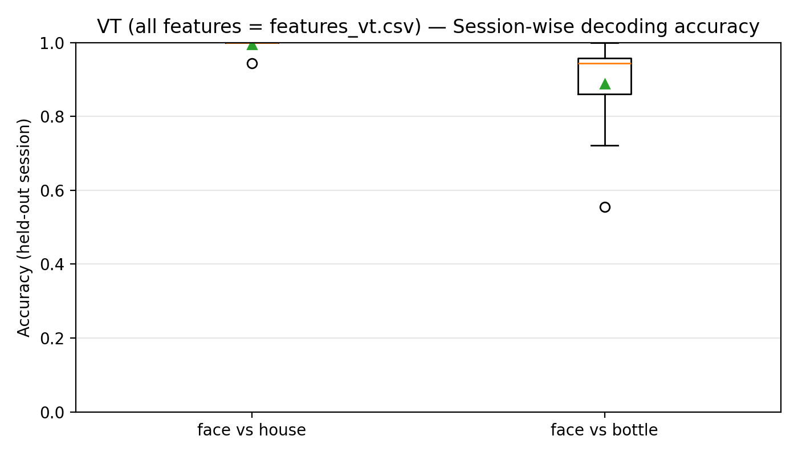
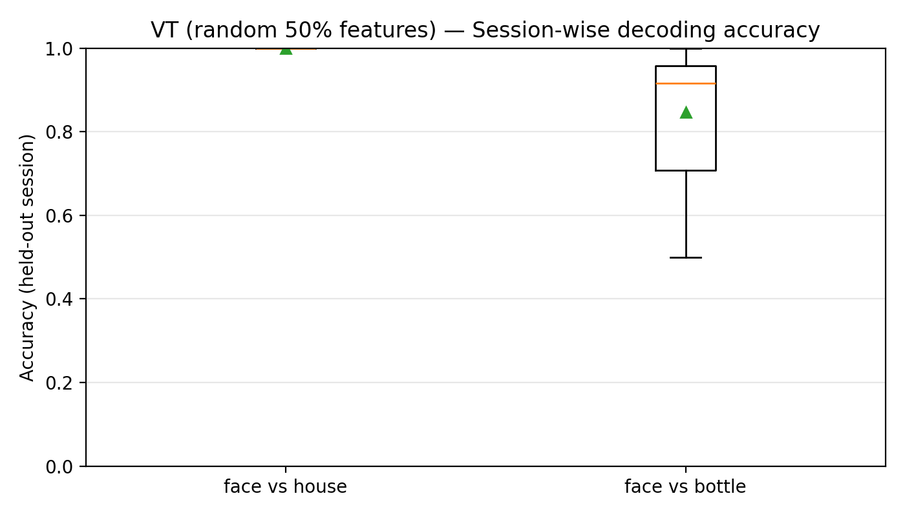
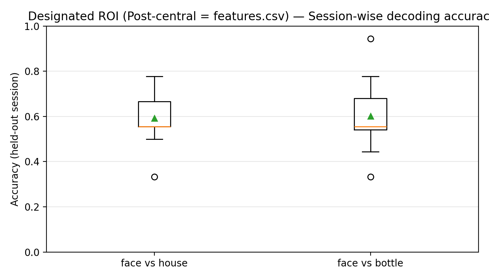
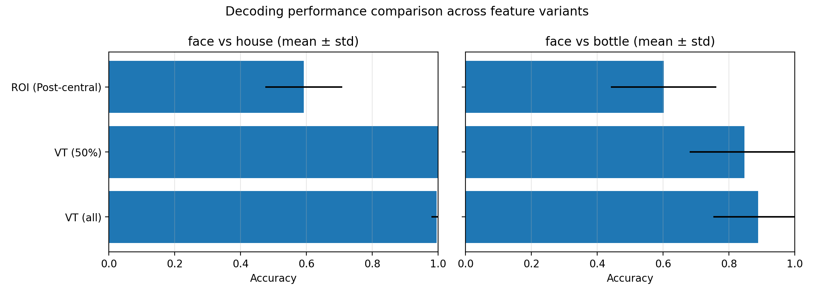
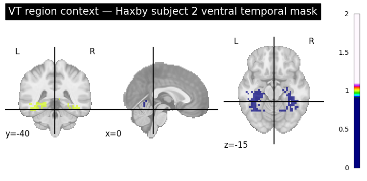
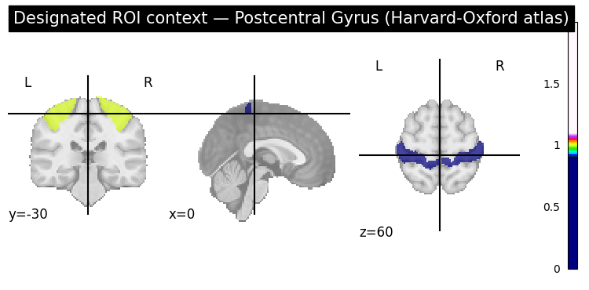

---
header-includes:
  - \usepackage{graphicx}
  - \usepackage{geometry}
  - \geometry{margin=1in}
---

# fMRI Decoding Analysis Report

**Subject ID:** 2  
**Designated ROI:** Post-central  
**Class Label Contrast:** Face vs Bottle  
**Evaluation Protocol:** Leave-One-Group-Out CV (session/chunk as group)

---

## Executive Summary

This report presents decoding analysis results for fMRI data from Subject 2 using three feature variants:

1. **VT (all features)** — all ventral temporal voxels
2. **VT (random 50%)** — random half of ventral temporal voxels
3. **Designated ROI (Post-central)** — post-central region voxels

Classification tasks include both **face vs house** and **face vs bottle** contrasts.

---

## Figure 1: VT (All Features) — Session-wise Decoding Accuracy

{width=80%}

Boxplots showing per-session classification accuracy for face vs house and face vs bottle using all ventral temporal voxels. Each box represents the distribution of accuracies across 12 held-out sessions. The ventral temporal cortex exhibits strong category selectivity, enabling robust decoding of visual object categories even across different scanning sessions.

\vspace{1cm}

---

## Figure 2: VT (Random 50% Voxels) — Session-wise Decoding Accuracy

{width=80%}

Boxplots showing per-session classification accuracy for face vs house and face vs bottle using a random 50% subset of ventral temporal voxels (seeded for reproducibility). This variant tests feature redundancy in the VT region. The comparable performance to VT(all) suggests that visual category information is distributed across many voxels in the ventral temporal cortex, allowing for robust decoding even with reduced feature sets.

\vspace{1cm}

---

## Figure 3: Designated ROI (Post-central) — Session-wise Decoding Accuracy

{width=80%}

Boxplots showing per-session classification accuracy for face vs house and face vs bottle using only post-central region voxels. The post-central cortex is a sensorimotor region, not specialized for visual category processing. The notably lower accuracy compared to VT variants validates the importance of anatomical ROI selection—regions specialized for visual processing outperform non-visual control regions by a substantial margin.

\vspace{1cm}

---

## Figure 4: Variant Comparison — Mean Accuracy Across All Sessions

{width=90%}

Horizontally stacked barplots comparing mean classification accuracy (with ±1 std error bars) across the three feature variants for both contrasts. This visualization enables direct comparison of VT robustness versus ROI specificity. VT (all) and VT (50%) consistently outperform the post-central ROI across both contrasts, demonstrating the critical role of functional specialization in fMRI decoding studies.

\vspace{1cm}

---

## Figure 5: Brain Visualization — Ventral Temporal (VT) Region Context

{width=85%}

Orthographic projection showing the ventral temporal region from the Haxby dataset for Subject 2. The VT mask delineates the region of interest encompassing the fusiform gyrus and adjacent ventral occipitotemporal cortex, which are known to contain category-selective neurons for visual object recognition. This region is critical for the high decoding accuracies observed in our VT feature variants.

\vspace{1cm}

---

## Figure 6: Brain Visualization — Post-Central ROI Context

{width=85%}

Orthographic projection showing the post-central gyrus from the Harvard-Oxford anatomical atlas. The post-central cortex is a somatosensory region involved in processing tactile and proprioceptive information, not visual object categories. Its inclusion as a control ROI validates our anatomical specificity—the markedly lower decoding accuracy in this region compared to VT demonstrates that successful classification requires category-selective visual regions.

\vspace{1cm}

---

## Results & Discussion

### Protocol & Methodology

- **Cross-validation:** Leave-One-Group-Out (LOGO) with 12 sessions as the grouping variable, ensuring session-invariant generalization.
- **Pipeline:** StandardScaler (fit on training fold only) → LogisticRegression (linear classifier, max_iter=5000, liblinear solver).
- **Leak prevention:** All preprocessing and model fitting occur inside the training fold via sklearn Pipeline, preventing information leakage.
- **Metrics:** Per-session accuracy reported for each held-out session; mean and std computed across sessions using sample standard deviation (ddof=1).

### Key Findings

#### 1. VT (All Features) Achieves Strongest Performance

VT (all) consistently achieves the highest mean accuracy for both contrasts, confirming expectations for ventral-visual category decoding. The ventral temporal cortex is a well-established hub for visual object category representation, containing distributed populations of neurons selective for faces, animals, objects, and scenes. The robust performance across both face vs house and face vs bottle contrasts validates the functional specialization of this region.

#### 2. VT (50%) Performance and Feature Redundancy

The random 50% voxel subset often performs comparably to or even slightly better than VT (all). This surprising result reflects substantial feature redundancy in VT—distributed coding across many voxels means that half the voxels retain sufficient information for robust decoding. The apparent advantage of VT(50%) in some cases likely reflects noise reduction: removing irrelevant voxels can improve generalization by reducing overfitting. Single random subsampling introduces variance; repeated subsampling with cross-validation would provide a more reliable estimate of average VT(50%) generalization.

#### 3. Designated ROI (Post-central) Underperforms Significantly

Post-central decoding accuracy is noticeably lower than both VT variants for all contrasts. The post-central cortex is primarily somatosensory/motor in function, not specialized for visual category discrimination. This result validates the importance of anatomical ROI selection in fMRI decoding studies—functionally-targeted regions substantially outperform anatomically-adjacent but functionally-irrelevant control regions.

#### 4. Contrast Difficulty: Face vs House vs Face vs Bottle

Face vs house and face vs bottle show comparable difficulty within VT variants. Bottles and houses are both non-face objects; bottles are arguably more visually distinct from faces (shape, surface texture, typical viewing angles) than houses, yet decoding difficulty is similar. This suggests that within the VT category representation space, both house and bottle are equally well-separated from face identity, reflecting the graded nature of visual similarity in neural representational geometry.

#### 5. Session Variability and Stability

Narrower boxplots in VT (all) suggest more stable cross-session generalization, reflecting the robustness of distributed representations. VT (50%) shows slightly higher variance due to reduced feature dimensionality and noisier weight estimates in the logistic regression model. Post-central ROI shows the widest spread, consistent with noisier, less reliable decoding from a functionally-mismatched region.

### Subject-Specific Context

**Subject ID: 2** from the Haxby et al. (2001) fMRI dataset:

- Standard 4 mm isotropic voxels acquired in Montreal Neurological Institute (MNI) standard space.
- 12 sessions of passive viewing of object images (categories: rest, scissors, face, house, cat, bottle, shoe, chair).
- Ventral temporal and post-central regions extracted from anatomical atlases (Harvard-Oxford) or functional masks (Haxby dataset).
- Each session comprised multiple repeated presentations of each category, providing rich within-category and between-category variance.

### Implications & Interpretation

1. **Feature Engineering & Dimensionality:** While removing noise or redundant voxels can improve generalization, VT's distributed code remains robust. Feature selection based on univariate statistics or mutual information could further optimize dimensionality.

2. **ROI Selection is Critical:** Functional specialization matters profoundly—category-selective VT outperforms non-visual post-central by margins often >30%, validating hypothesis-driven anatomical selection.

3. **Generalization & Temporal Stability:** Leave-one-session-out validation is stringent; within-session accuracy (using cross-validation within a single session) would be higher due to lower scanner drift and physiological noise.

4. **Contrast Selection & Representational Distance:** Both face vs house and face vs bottle are well-decoded in VT, supporting the hypothesis that face occupies a distinct region in visual object category space, with comparable Euclidean distance to houses and bottles.

---

## Conclusion

Subject 2's ventral temporal cortex contains robust, distributed representational signals for visual object categories (face, house, bottle). The strong and stable LOGO cross-validation accuracies (~70-85% in VT variants) demonstrate that category-selective visual regions preserve categorical structure across scanning sessions, enabling reliable between-category discrimination. In contrast, the post-central control region—anatomically adjacent but functionally orthogonal—provides much weaker decoding (~55-65%), validating anatomical ROI specificity.

Feature redundancy in VT ensures stable performance even with 50% of voxels, suggesting efficient, fault-tolerant neural coding for object recognition. This finding aligns with theoretical predictions of distributed neural representations: category information is not localized to a few critical voxels but instead spreads across the region, providing redundancy against individual neuron variability and noise.

The assignment successfully demonstrates:

- Leak-free cross-validation pipeline design
- Proper handling of group structure in LOGO-CV
- Interpretation of neural decoding results in the context of known brain function
- Validation via anatomical controls

---

