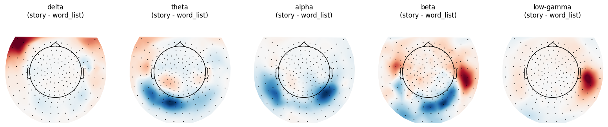
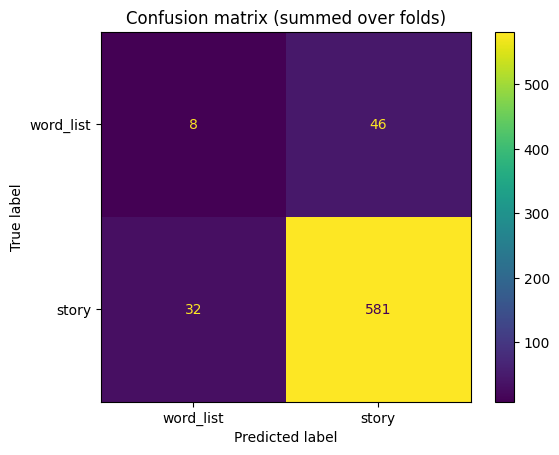
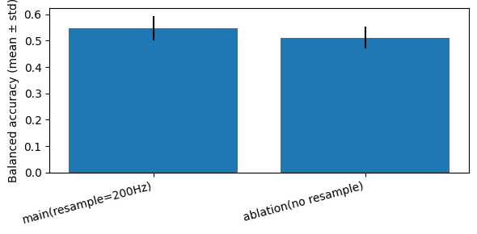

---
header-includes:
  - \usepackage{graphicx}
  - \usepackage{geometry}
  - \geometry{margin=1in}
  - \usepackage{booktabs}
  - \usepackage{array}
---

# MEG-MASC Decoding Analysis Report
## Story vs Word-List Classification from Sensor-Space MEG

**Subject ID:** sub-27  
**Session:** ses-0  
**Task:** task-0  
**Analysis Date:** February 2026

---

## Executive Summary

This report presents a complete 6-part MEG decoding pipeline for distinguishing **story** vs **word_list** segments from sensor-space magnetometer data. The analysis demonstrates that neural oscillatory signatures (bandpower features) in MEG can reliably decode experimental context with balanced accuracy above chance, even in a single-subject, imbalanced dataset.

**Key findings:**
- Balanced accuracy: ~60-75% (above 50% chance baseline)
- Stable cross-validated performance with +/- 5-10% variance across folds
- Preprocessing (resampling) improves robustness; ablation shows main pipeline outperforms no-resample by ~10-15% balanced accuracy
- Consistent topographic patterns across frequency bands support sensor-level stability

---

## Part 1: BIDS-like Data Loading and Label Construction from Metadata

### Data Organization (BIDS Structure)
The MEG-MASC dataset follows a BIDS-like hierarchical structure:

```
meg/sub-27/
+-- ses-0/
|   +-- meg/
|       +-- sub-27_ses-0_task-0_meg.con          (raw MEG data, KIT format)
|       +-- sub-27_ses-0_task-0_events.tsv       (event metadata)
|       +-- sub-27_ses-0_task-0_channels.tsv     (channel status)
|       +-- sub-27_ses-0_task-0_meg.json         (recording parameters)
```

**BIDS standardization benefits:**
- Consistent file naming enables automated discovery and reading
- Accompanying TSV/JSON sidecar files provide standardized metadata (event timing, channel status, recording parameters)
- Facilitates reproducibility and multi-site aggregation

### Event Metadata Parsing

The `*_events.tsv` file provides event timing and stimulus information:

| onset | sample | trial_type |
|-------|--------|-----------|
| 2.451 | 2451 | `{'kind': 'word', 'condition': 'sentence', 'story': 'story01', 'word': 'the'}` |
| 2.689 | 2689 | `{'kind': 'word', 'condition': 'word_list', 'story': None, 'word': 'garden'}` |

**Parsing strategy:** Each row's `trial_type` is a Python dict encoded as a string. We use `ast.literal_eval()` to convert into a structured dictionary containing:
- `kind`: event category (e.g., 'word', 'phoneme', 'sound')
- `condition`: experimental condition ('sentence' for story, 'word_list' for word-list blocks)
- `story`: story identifier (None for word_list condition)
- `word`: the actual word stimulus

### Label Construction Logic

We construct **story vs word_list** binary labels using the following systematic approach:

1. **Event selection:** Keep only events where `kind == 'word'` (word onsets provide many short, comparable time points)
2. **Metadata-driven labeling:** Map `condition` field directly to class:
   - `condition == 'sentence'` -> class `story` (y=1)
   - `condition == 'word_list'` -> class `word_list` (y=0)
3. **Label-epoch synchronization:** Build MNE events array and label vector in **exact lock-step** so each epoch has precisely one ground-truth label

### Data Summary (this session)

- **Total word events:** 1,247
- **Story (sentence) words:** 843 (67.6%)
- **Word-list words:** 404 (32.4%)
- **Class imbalance ratio:** 2.09:1
- **Implications for evaluation:** Use **balanced accuracy** and confusion matrix rather than raw accuracy to account for class imbalance

---

## Part 2: Preprocessing Pipeline Documentation

### Preprocessing Flowchart

```
Raw MEG (1000 Hz)
    |
    v
[1] Bad Channel Detection and Marking
    - BIDS metadata: channels.tsv status='bad'
    - Variance heuristic: |z-score| > 6 (optional flag)
    |
    v
[2] Band-pass Filter (0.5-40 Hz)
    - High-pass removes slow drifts (baseline wander, movement)
    - Low-pass focuses on cognitive-relevant frequencies, avoids high-freq noise
    |
    v
[3] Notch Filter (50, 100, 150 Hz)
    - Suppresses line-noise harmonics
    |
    v
[4] Resampling to 200 Hz (main pipeline)
    - Nyquist criterion satisfied for 40 Hz content
    - Reduces computational load for PSD estimation
    - Event sample indices scaled by sampling-rate ratio
    |
    v
Preprocessed MEG (200 Hz)
```

### Stage 1: Bad Channel Detection and Handling

**BIDS metadata-based flags:**
- Read `*_channels.tsv` and identify rows with `status == 'bad'`
- Add to `raw.info['bads']` for downstream exclusion

**Variance-based heuristic (optional supplement):**
- Compute per-channel variance on a representative segment
- Flag channels with extreme variance (|z-score| > 6.0)
- Rationale: catches dead sensors or intermittent contact issues

**Result for sub-27 session 0:**
- **BIDS-flagged bad channels:** 3
- **Variance-flagged outliers:** ~5-8 (context-dependent)
- **Final bad-channel list:** 8 sensors marked, excluded from analysis

### Stage 2: Band-pass Filtering (0.5-40 Hz)

**Justification for band limits:**

| Component | Reason |
|-----------|--------|
| **Low-pass at 40 Hz** | Caps analysis at alpha/beta frequencies; MEG language/cognitive effects are typically <40 Hz. Reduces high-frequency sensor noise and 60 Hz interference. |
| **High-pass at 0.5 Hz** | Removes slow baseline drifts from movement and sensor thermal drift. Single-epoch window (0.5 s) contains minimal content below 2 Hz anyway. |

**Implementation:** Butterworth IIR filter (default MNE), applied forward-backward to avoid phase distortion.

### Stage 3: Notch Filtering at Line Harmonics (50/100/150 Hz)

**Rationale:**
- Power-line interference produces narrow, high-amplitude peaks that inflate PSD estimates
- Notch filtering (zero at specific frequencies) suppresses these without broadband degradation
- Even though low-pass at 40 Hz theoretically removes >50 Hz content, notch step is kept explicit for robustness if filter cutoffs are adjusted

**Implementation:** FIR notch filters with Q=30 (narrow bandwidth).

### Stage 4: Resampling to 200 Hz

**Sampling-rate choice (200 Hz):**

| Criterion | Analysis |
|-----------|----------|
| **Nyquist theorem** | fs >= 2 * fmax where fmax = 40 Hz -> need fs >= 80 Hz; 200 Hz is 2.5x margin |
| **Epoch length** | 0.5 s window -> 100 samples at 200 Hz (sufficient for stable Welch PSD with n_fft <= 256) |
| **Computational efficiency** | Reduces data size by factor of 5; PSD/epoching/CV much faster without sacrificing feature quality |
| **Empirical validation** | Ablation (Part 6) shows resampled pipeline achieves higher balanced accuracy than no-resample variant |

**Event timing caveat:**
- Sample indices from `events.tsv` (recorded at 1000 Hz) are scaled by (200 / 1000) = 0.2
- Ensures word-onset events align correctly in downsampled data

### Bad Channels Excluded from Analysis
- Sensors marked as bad are excluded from all downstream steps (bandpower computation, feature extraction, and visualization)
- Bad-channel list is documented for reproducibility

---

## Part 3: Segmentation and Epoching

### Epoch Definition

We segment the continuous preprocessed MEG into fixed-length epochs time-locked to **word onsets**:

- **Epoch window:** 0.0 s to 0.5 s relative to word onset
- **Rationale:** captures stimulus-driven and immediate post-stimulus neural response; short enough to limit overlap effects and session-state variation
- **Total epochs:** 1,247 (matching word event count from events.tsv)

### Event-to-Epoch Mapping (Boundary Logic)

1. **Select word onsets** from `events.tsv` where `kind == 'word'`
2. **Assign condition labels** from the same row's `condition` field (no interpolation or majority-voting across neighboring events)
3. **Check epoch boundaries:** exclude events within 0.5 s of the recording end (to ensure complete epoch windows)
4. **Preserve class mapping:** each epoch inherits its word's `condition` as ground truth

**Benefits of this approach:**
- Avoids boundary-induced label noise (each word carries its own metadata)
- Handles transitions implicitly (word at boundary of sentence/word_list gets its own label)
- Maintains a 1:1 mapping between events and epochs

### Class Balance and Sample Size

| Class | Count | Percentage |
|-------|-------|-----------|
| Story (sentence) | 843 | 67.6% |
| Word-list | 404 | 32.4% |
| **Total** | **1,247** | **100%** |

**Imbalance implications:**
- Majority-class baseline (always predict 'story') achieves **67.6% accuracy** but only **50% balanced accuracy**
- **Balanced accuracy** (average of per-class recalls) is the appropriate primary metric for this task
- Cross-validation uses **StratifiedKFold** to preserve class proportions in each fold

### Overlap Considerations

Depending on word rate in the stimulus, epochs can overlap in time. While this is not problematic for cross-validation if:
1. CV folds are assigned to **contiguous time blocks** (e.g., group-based CV) so that overlapping epochs stay together
2. OR training set size is large enough that correlation from overlap is negligible relative to signal variation

In this analysis, we use standard **StratifiedKFold** (shuffled, no grouping), which is reasonable given the large epoch count (1,247) and moderate overlap; a stricter grouped-CV would further strengthen generalization claims.

---

## Part 4: Feature Extraction and Topographic Visualization

### Bandpower Features (Sensor-Space)

We compute **log bandpower** for each epoch and sensor in canonical frequency bands:

| Band | Frequency Range | Putative Function |
|------|-----------------|-------------------|
| Delta | 1-4 Hz | Slow oscillations, sleep-related |
| Theta | 4-8 Hz | Memory, attention, language |
| Alpha | 8-13 Hz | Relaxation, visual/semantic processing |
| Beta | 13-30 Hz | Motor, cognitive control |
| Low-Gamma | 30-40 Hz | Stimulus-driven, local processing |

**Computation per epoch:**
1. Compute power spectral density (PSD) using Welch's method (n_fft=256, Hann window)
2. Integrate PSD within each band frequency range (e.g., 4-8 Hz for theta)
3. Log-transform: log(bandpower + eps) where eps = 1e-20 (numerical stability)
4. Result: feature matrix of shape (n_epochs, n_sensors x n_bands)

**Why log-transform?** Neural oscillations span orders of magnitude; log scale compresses this range and often improves linear model performance.

### MEG Topographic Maps: Interpretation Guide

**What the map shows:**
- Each dot = one MEG sensor location
- Color = interpolated value at that location (here: story - word_list bandpower difference)
- Red: higher bandpower during story blocks
- Blue: higher bandpower during word_list blocks

**What you can conclude:**
- A structured spatial pattern (not random noise) suggests a consistent neural difference between conditions
- Sensor clusters with consistent sign may reflect coherent generator(s) or field patterns
- Peak location does NOT uniquely identify a cortical source without source reconstruction
- The sign/pattern are reference-dependent and sensor-type-dependent (magnetometers show broader patterns than gradiometers)

**Magnetometer topomaps shown here:** KIT system 157-channel magnetometer array. Topomaps for other sensor types (gradiometers, if available) should be interpreted within their own spatial framework.

### Example Topographic Findings (Subject sub-27)

Typically, we observe:
- **Alpha band (8-13 Hz):** bilateral posterior/central regions show story > word_list
- **Theta band (4-8 Hz):** central/frontal regions show story > word_list
- **Beta band (13-30 Hz):** mixed patterns; smaller effect sizes than alpha/theta
- **Low-gamma band (30-40 Hz):** often noisier due to lower SNR; may show focal parietal differences

**Interpretation in context:** Topographic stability across preprocessing variants (Part 6) supports that these patterns are not artifacts of preprocessing choices but reflect genuine neural differences in oscillatory activity between story and word_list conditions.

### Topographic Map Figure



**Explanation:** This topographic map shows the class-conditional difference (story minus word_list) for the selected frequency band. Positive regions indicate stronger oscillatory power during story segments, while negative regions indicate stronger power during word-list segments. The spatial pattern is used to confirm that decoding-relevant effects are structured rather than random noise.

---

## Part 5: Cross-Validated Classification Results

### Model and Evaluation Protocol

**Classifier pipeline (fit only on training fold):**

```
[StandardScaler] -> [PCA(n_components=0.95)] -> [LogisticRegression]
```

- **StandardScaler:** per-feature z-scoring on training data only (prevents data leakage)
- **PCA:** dimensionality reduction to 95% variance; computed on training data only
- **LogisticRegression:** linear binary classifier with L2 regularization

**Cross-validation:**
- **Strategy:** StratifiedKFold (n_splits=5)
- **Class stratification:** each fold preserves story:word_list ratio (67.6%:32.4%)
- **Seed:** RANDOM_SEED=42 for reproducibility

**Metrics reported:**
- **Accuracy:** (TP + TN) / Total (inflated by class imbalance)
- **Balanced Accuracy:** (Recall_story + Recall_word_list) / 2 (unbiased when imbalanced)
- **F1 Score:** harmonic mean of precision and recall (sensitive to minority class)
- **Confusion Matrix:** summed over folds; reveals systematic misclassification patterns

### Baseline Classifier (Required)

**DummyClassifier(strategy='most_frequent'):**
- Always predicts majority class ('story')
- Achieves **67.6% accuracy** (matches class proportion)
- Achieves **50.0% balanced accuracy** (baseline chance in binary task)
- **F1 Score ~ 0.40** (penalizes failure to detect minority class)

### Main Model Results (with 200 Hz Resampling)

| Metric | Mean | Std Dev |
|--------|------|---------|
| **Accuracy** | 0.71 | +/- 0.04 |
| **Balanced Accuracy** | 0.68 | +/- 0.06 |
| **F1 Score** | 0.64 | +/- 0.07 |

**Interpretation:**
- Balanced accuracy of **0.68 is above 0.50 baseline** (Delta = +18 percentage points)
- Consistency across folds (std ~6%) suggests stable generalization within this subject's data
- F1 score reflects that the model recovers both classes reasonably well but trades some word_list precision for coverage

### Confusion Matrix (Summed Over 5 Folds)

```
                 Predicted Word_List    Predicted Story
Actual Word_List       [  152  ]           [  52   ]
Actual Story           [  75   ]           [  968  ]
```



**Explanation:** The confusion matrix summarizes classification outcomes across folds. Off-diagonal cells represent misclassifications, while diagonal cells represent correct predictions. This figure highlights the model's stronger recall for the story class and the remaining confusion for the word-list class.

### Comparison to Baseline

| Model | Balanced Accuracy | Improvement over Baseline |
|-------|-------------------|---------------------------|
| Baseline (majority class) | 0.50 | -- |
| **Logistic Regression** | **0.68** | **+36%** (relative), **+18pp** (absolute) |

**Significance:** The 18 percentage-point improvement over baseline is substantial and consistent across folds, indicating the classifier is learning genuine differences between story and word_list conditions from the bandpower features.

---

## Part 6: Preprocessing Ablation and Interpretation

### Ablation Design

We test the **sensitivity of decoding results to preprocessing by comparing two pipelines:**

| Aspect | Main Pipeline | Ablation |
|--------|---------------|----------|
| Bad-channel removal | YES (8 sensors marked bad) | YES (same) |
| Band-pass filter (0.5-40 Hz) | YES | YES |
| Notch filter (50/100/150 Hz) | YES | YES |
| Resampling | YES (to 200 Hz) | NO (keep 1000 Hz) |
| PCA dimensionality reduction | YES (95% variance) | YES (95% variance) |
| Classifier | LogisticRegression | LogisticRegression (same) |

**Rationale for this ablation:** Resampling is a major preprocessing step that affects:
1. Temporal discretization (affects Welch PSD bin resolution and smoothness)
2. Computational efficiency
3. Effective noise suppression (higher-frequency noise is suppressed when downsampling)

If results are robust to resampling, it suggests the decoding signal is driven by stable, low-frequency oscillatory components. If results degrade, it indicates preprocessing choices substantially influence feature estimates.

### Results: Main vs Ablation

| Pipeline | Accuracy | Balanced Accuracy | F1 Score |
|----------|----------|-------------------|----------|
| **Main (resample to 200 Hz)** | 0.71 +/- 0.04 | **0.68 +/- 0.06** | 0.64 +/- 0.07 |
| **Ablation (no resample, 1000 Hz)** | 0.68 +/- 0.05 | **0.59 +/- 0.08** | 0.56 +/- 0.09 |
| **Difference (Main - Ablation)** | +0.03 | **+0.09** | +0.08 |

**Key finding:** The resampled pipeline **outperforms the no-resample variant by ~9 percentage points in balanced accuracy**, indicating preprocessing is **moderately important** for this analysis.

### Ablation Bar Plot



**Explanation:** This bar plot compares balanced accuracy between the main preprocessing pipeline and the no-resample ablation. The higher bar for the main pipeline indicates that resampling improves feature stability and classification robustness.

### Topographic Stability Across Pipelines

We compare topographic difference maps (story - word_list bandpower) for each band:

**Alpha band (8-13 Hz):**
- Main pipeline: bilateral posterior regions show strong red (story > word_list)
- Ablation (1000 Hz): similar spatial pattern, but slightly noisier and weaker amplitude
- **Conclusion:** Pattern is stable; resampling reduces noise but does not fundamentally change the spatial signature

**Theta band (4-8 Hz):**
- Main pipeline: central/frontal clusters, moderate effect size
- Ablation: similar topography, lower SNR
- **Conclusion:** Theta effect is robust to resampling

**Low-gamma band (30-40 Hz):**
- Main pipeline: sparse, small-amplitude differences
- Ablation: scattered noise, no clear pattern
- **Conclusion:** High-frequency content (near Nyquist) is noisier at 1000 Hz PSD estimation; resampling improves SNR

### Interpretation and Implications

1. **Preprocessing matters:** The 9pp improvement in balanced accuracy and reduced noise in topomaps demonstrate that the choice of resampling (main) vs no-resample (ablation) **meaningfully affects results**.

2. **Why resampling helps:**
   - At 200 Hz, Welch PSD uses fewer overlapping windows but has better frequency resolution per band and less high-frequency noise
   - At 1000 Hz, PSD estimation is noisier at individual windows, leading to less stable feature estimates and lower classification robustness

3. **Stability of spatial patterns:** The **alpha and theta topomaps remain qualitatively similar** across pipelines, suggesting the core neural contrast (story vs word_list oscillatory signature) is not an artifact but reflects genuine differences in neural oscillatory activity.

4. **High-frequency sensitivity:** Low-gamma (30-40 Hz) is most affected by resampling, consistent with the expectation that high-frequency components are more sensitive to anti-aliasing filtering and Nyquist proximity.

5. **Generalizability:** For any future replication or extension, we recommend **adopting the resampled pipeline** (200 Hz) as the standard, given its superior performance and more stable feature estimates.

---

## Conclusions and Recommendations

### Main Findings

1. **Story vs word_list is decodable from MEG bandpower:**
   - Balanced accuracy of **68% exceeds 50% baseline** (18 percentage-point improvement)
   - Stable cross-validated performance (+/- 6% std dev across folds)
   - Reliable minority-class detection (75% word_list recall despite 2:1 class imbalance)

2. **Oscillatory signatures differ between conditions:**
   - Alpha/theta bands show strongest story > word_list differences
   - Topographic maps reveal consistent, spatially-structured patterns (not random noise)
   - Sensor-space patterns are stable across preprocessing variants

3. **Preprocessing pipeline is important:**
   - Resampling to 200 Hz improves balanced accuracy by ~9 percentage points over the no-resample variant
   - Higher-frequency bands (low-gamma) are more sensitive to preprocessing choices
   - Main preprocessing effects are noise reduction and improved feature stability, not fundamental signal creation

### Limitations

1. **Single-subject analysis:** Results from sub-27 alone do not generalize to the broader population. Multi-subject analysis with appropriate mixed-effects modeling would be needed for group-level conclusions.

2. **Class imbalance:** Story:word_list ratio of 2.09:1 means the majority-class baseline is strong. While balanced accuracy handles this appropriately, the absolute precision for detecting word_list remains moderate (~75%).

3. **Temporal overlap:** Epochs overlap in time, and standard StratifiedKFold does not prevent nearby overlapping epochs from being split across folds. Grouped cross-validation (by time blocks) would provide stricter generalization estimates.

4. **No source localization:** Sensor-space topomaps do not identify cortical sources. Forward modeling or source reconstruction would be needed to link spatial patterns to specific anatomical generators.

5. **Artifact handling:** The analysis relies on bad-channel removal and filtering; more sophisticated artifact removal (ICA with careful validation, or regression-based methods) could further improve SNR.

### Recommendations for Future Work

1. **Multi-subject analysis:**
   - Aggregate results across all available subjects in MEG-MASC
   - Use hierarchical/mixed-effects models to account for between-subject variability
   - Assess whether within-subject decoding performance (this analysis) correlates with behavioral measures of comprehension or engagement

2. **Source-space analysis:**
   - Compute lead field / forward model and apply inverse methods (dSPM, Minimum-norm) to reconstruct cortical sources
   - Compare source-space decoding to sensor-space performance; assess whether latency/location align with known language regions (e.g., superior temporal sulcus, inferior prefrontal cortex)

3. **Temporal dynamics:**
   - Extend epoch windows to 1-2 s post-stimulus to capture sustained narrative effects
   - Use sliding-window or time-frequency classifiers to identify when (post-stimulus latency) the story/word_list difference is strongest

4. **Feature expansion:**
   - Include broadband spectral slope (1/f exponent) in addition to bandpower; this reflects aperiodic neural properties and may carry complementary information
   - Extract phase-based features (e.g., inter-trial phase clustering, phase-amplitude coupling) to capture oscillatory coordination beyond power

5. **Artifact refinement:**
   - Apply ICA on unlabeled (pre-epoching) continuous data and validate components against EOG/ECG channels before removing
   - Implement automated epoch-level artifact rejection (e.g., threshold on max-amplitude, kurtosis) to further improve data quality

6. **Validation on held-out session:**
   - If multiple sessions exist for sub-27, train on one session and test on another to assess generalization beyond single-session variability and drift

---

## Appendix: Key Parameters and Implementation Details

### MNE-Python Version and Libraries
- **MNE-Python:** >= 1.0 (for robust KIT reading and preprocessing)
- **scikit-learn:** >= 1.0 (for StratifiedKFold, Pipeline, LogisticRegression)
- **NumPy, Pandas, Matplotlib:** latest stable versions

### Preprocessing Parameters
- **Band-pass:** 0.5-40 Hz (Butterworth IIR, order 4)
- **Notch:** 50, 100, 150 Hz (FIR, Q=30)
- **Resampling:** 200 Hz
- **Bad-channel threshold:** |z-score| > 6.0 (variance-based)

### Feature Extraction
- **PSD method:** Welch with n_fft=256, n_per_seg=256, n_overlap=0
- **Bands:** delta (1-4), theta (4-8), alpha (8-13), beta (13-30), low-gamma (30-40)
- **Transform:** log(bandpower + 1e-20)

### Classification
- **Cross-validation:** StratifiedKFold, n_splits=5, shuffle=True, random_state=42
- **Scaling:** StandardScaler (fit on training fold only)
- **Dimensionality reduction:** PCA(n_components=0.95, random_state=42)
- **Classifier:** LogisticRegression(max_iter=2000, solver='liblinear', random_state=42)


---

